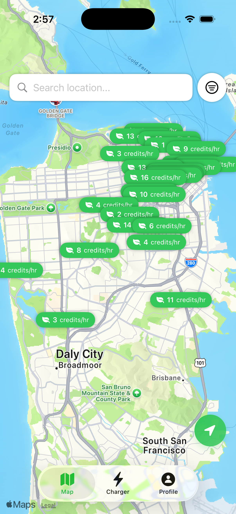
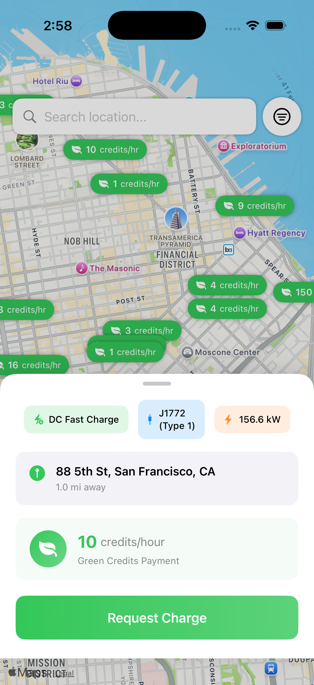
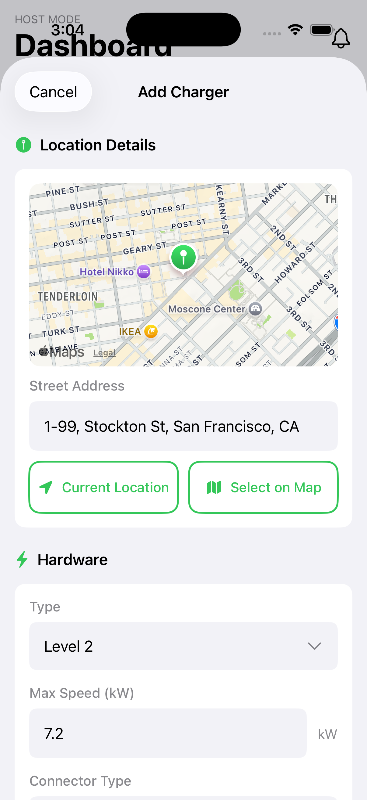
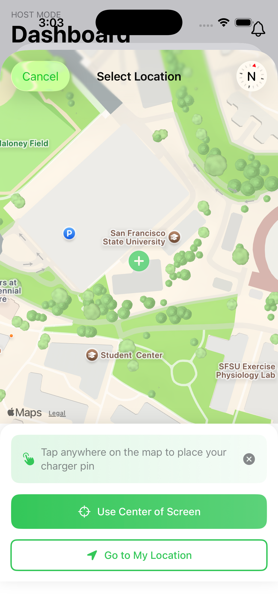
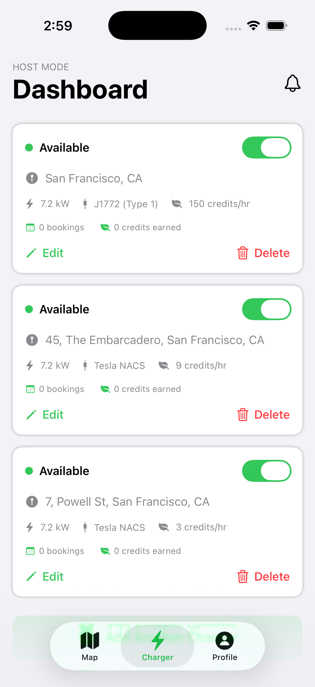
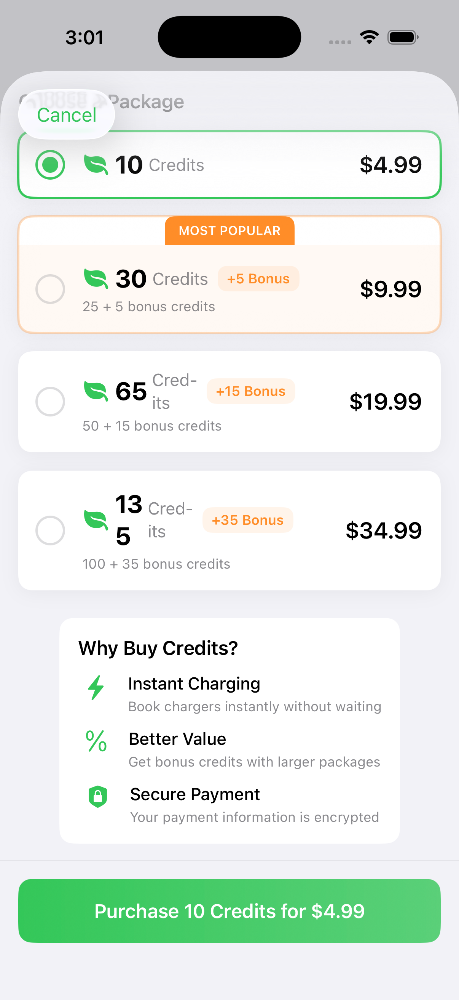

# PlugIn - EV Charger Sharing Platform

A native iOS application that connects electric vehicle drivers with EV charger hosts in their community, enabling a seamless peer-to-peer charger booking experience. Built with **SwiftUI** and **Firebase**, PlugIn bridges the gap between EV charging infrastructure scarcity and underutilized residential chargers.

---

## **Video Demo**

[](https://youtu.be/Xc5KtwcJPWE)

**Watch the full demo to see:**
- Full driver flow: map navigation → filtering → booking
- Host flow: adding charger → managing requests
- Real-time updates demonstration
- Two-sided marketplace in action

---

## **Screenshots & Demo**

### **Key Screens**

<div align="center">

**Screenshot 1: Driver Map View**



</div>

- Interactive map showing real-time charger locations with green pins
- Each pin displays available credits/hour for the charger
- Search location bar at the top for finding specific areas
- Filter button to refine chargers by type, connector, price, and availability
- Location indicator showing user's current position
- Tab navigation showing Map, Charger, and Profile tabs

<div align="center">

**Screenshot 2: Charger Detail View**



</div>

- Detailed charger information (type: DC Fast Charge, connector: J1772 Type I)
- Charger specifications (max speed: 156.6 kW)
- Host address and distance from current location
- Pricing displayed in green credits per hour
- "Request Charge" button to initiate a booking
- Map preview showing exact charger location

<div align="center">

**Screenshot 3: Add Charger - Location Details**



</div>

- Host dashboard header with "Add Charger" option
- Map displaying charger location with placement pin
- Street address field pre-populated with detected location
- "Current Location" button for quick location selection
- "Select on Map" button for manual location picking
- Hardware specifications section (Charger Type: Level 2, Max Speed: 7.2 kW)
- Connector Type dropdown for selecting compatible connectors

<div align="center">

**Screenshot 4: Location Picker**



</div>

- Interactive map for precise charger location placement
- Green + marker showing selected position
- Instruction text: "Tap anywhere on the map to place your charger pin"
- "Use Center of Screen" button to confirm center location
- "Go to My Location" button to place at current GPS location
- Clean, intuitive interface for location selection

<div align="center">

**Screenshot 5: Host Dashboard**



</div>

- "HOST MODE" header with "Dashboard" title
- Bell icon for incoming request notifications
- List of registered chargers with cards showing:
  - Availability toggle (green when available)
  - Charger address and location
  - Hardware specs (charging speed, connector type)
  - Credits earned count
  - Edit button to modify charger details
  - Delete button with destructive styling (red)
- Bottom tab navigation (Map, Charger, Profile)

<div align="center">

**Screenshot 6: Add Credits**



</div>

- Credit purchase packages with different tiers:
  - 10 Credits for $4.99 (entry level)
  - 30 Credits for $9.99 (25% bonus credits)
  - 65 Credits for $19.99 (15% bonus credits)
  - 130 Credits for $34.99 (35% bonus credits)
- "MOST POPULAR" badge on the most purchased tier
- Bonus credit information displayed for each package
- "Why Buy Credits?" section explaining benefits:
  - Instant Charging
  - Better Value
  - Secure Payment
- Green "Purchase 10 Credits for $4.99" button for completing transaction

---

## **Project Overview**

**PlugIn** is a two-sided marketplace iOS app that solves a real-world problem: EV drivers struggle to find available chargers, while many homeowners with chargers want to share them and earn credits. The app facilitates connections between these two groups through an intuitive, map-based interface.

### **Target Users**
- **Drivers**: Users looking for nearby available EV chargers with real-time availability
- **Hosts**: EV charger owners who want to share their chargers and earn green credits

### **Problem Statement**
- Limited public EV charging infrastructure in many regions
- Inefficient use of private residential chargers
- Lack of seamless, trustworthy platforms for peer-to-peer charger sharing
- Need for transparent pricing and availability management

### **Solution**
PlugIn provides a unified platform where:
- Drivers can discover nearby chargers on a live map with filters
- Hosts can manage their chargers and respond to booking requests in real-time
- Both parties can track booking history, ratings, and credits

---

## **Key Features**

### **For Drivers**
- **Interactive Map View**: Real-time charger discovery with location-based search
- **Advanced Filtering**: Filter by charger type, connector type, credits per hour, and availability schedule
- **Location Services**: One-tap "current location" and real-time distance calculations
- **Booking System**: Request charger bookings with estimated duration and immediate feedback
- **Green Credits System**: Purchase and track credit balance for charger usage
- **Booking History**: View past requests grouped by date with status tracking
- **Rating System**: Rate chargers and provide feedback after usage
- **Profile Management**: Upload profile photos, manage account settings, privacy controls

### **For Hosts**
- **Charger Management**: Register and manage multiple EV chargers with detailed specs
- **Availability Scheduling**: Set weekly availability schedule with specific hours
- **Request Management**: Real-time notifications and quick accept/decline functionality
- **Dashboard Analytics**: Track total bookings, earnings, and charger performance
- **Pricing Control**: Set custom credit rates per charger
- **Host Verification**: Verified badge display to build trust
- **Request Sheet UI**: Streamlined interface for managing incoming booking requests

### **Core Cross-Platform Features**
- **Firebase Authentication**: Email/password signup and signin with persistent sessions
- **Real-time Data Sync**: Firestore listeners for instant updates across devices
- **Photo Management**: Firebase Storage integration for profile and charger images
- **Geo-location**: CoreLocation integration with GeoPoint storage in Firestore
- **Responsive Design**: Optimized for iPhone and iPad with portrait orientation support

---

## **Architecture & Technical Design**

### **Architecture Pattern**
The app follows a **Clean Architecture** with clear separation of concerns:

```
PlugIn/
├── App/                           # App entry point & lifecycle
├── Configuration/                 # Build & environment config
├── Core/
│   ├── Services/                 # Business logic services
│   │   ├── Firebase/             # Auth, Firestore, Storage
│   │   └── Location/             # CoreLocation wrapper
│   ├── Navigation/               # Routing & coordination
│   ├── Components/               # Reusable UI components
│   └── Utilities/
│       ├── Extensions/           # Swift extensions
│       ├── Helpers/              # Formatting, validation
│       └── Constants/
├── Domain/
│   ├── Models/                   # Codable data structures
│   ├── Enums/                    # Type-safe enumerations
│   └── Repositories/             # Data access layer
└── Views/
    ├── Root/                     # Navigation & tab views
    ├── Authentication/           # Sign-up flows
    ├── Driver/                   # Map & charger discovery
    ├── Booking/                  # Booking flows
    ├── AddCharger/               # Host charger registration
    ├── HostDashboard/            # Host management interface
    ├── Request/                  # Booking requests handling
    ├── Profile/                  # User account management
    └── Common/Components/        # Shared UI components
```

### **Design Patterns Used**

1. **MVVM (Model-View-ViewModel)**
   - Each screen has a corresponding `@MainActor` ViewModel
   - Two-way binding via `@Published` properties
   - Example: `DriverMapViewModel`, `BookingViewModel`, `HostDashboardViewModel`

2. **Repository Pattern**
   - `ChargerRepository` & `BookingRepository` abstract Firestore operations
   - Enables testing and data source flexibility
   - Single source of truth for data access

3. **Coordinator Pattern**
   - `AppCoordinator` manages navigation state and sheet presentations
   - Centralized routing logic (type-safe `NavigationDestination` enum)
   - Decouples views from navigation responsibilities

4. **Service Layer**
   - `AuthService`: Manages Firebase Auth state with persistent listeners
   - `FirestoreService`: Centralized Firestore operations
   - `LocationService`: Abstracts CoreLocation functionality
   - `FirebaseStorageService`: Handles image uploads/downloads

5. **Environment Objects**
   - `AuthService`, `LocationService`, and `AppCoordinator` passed via SwiftUI environment
   - Global access without prop drilling

---

## **Technology Stack**

### **Frontend**
- **SwiftUI**: Modern declarative UI framework (iOS 16+)
- **MapKit**: Interactive map with custom pin annotations
- **CoreLocation**: Location tracking and permissions handling
- **Combine**: Reactive programming for data binding

### **Backend & Services**
- **Firebase Authentication**: Email/password authentication with state persistence
- **Firestore Database**: Real-time NoSQL database with listeners
- **Firebase Storage**: Cloud storage for user profile and charger images
- **Firebase Core**: Foundation for all Firebase services

### **Development Tools**
- **Xcode**: IDE and project management
- **Swift Package Manager**: Dependency management
- **Firebase iOS SDK**: Cocoapods/SPM integration
- **Git**: Version control

### **Deployment**
- **iOS 16.0+**: Minimum deployment target
- **Universal App**: Optimized for iPhone and iPad

---

## **Key Technical Challenges & Solutions**

### **Challenge 1: Real-time Data Synchronization**
**Problem**: Multiple users viewing the same chargers and bookings needed instant updates without stale data.

**Solution**:
- Implemented Firestore snapshot listeners in repositories and services
- `AuthService` maintains persistent auth state listener with race condition handling
- `DriverMapViewModel` auto-refreshes charger list with filter reapplication
- Implemented `@MainActor` dispatch to ensure UI updates on main thread safely

**Code Location**: `Core/Services/Firebase/AuthService.swift:122-148`
```swift
private func listenToUserData(uid: String) {
    userListener = Firestore.firestore().collection("users").document(uid)
        .addSnapshotListener { [weak self] snapshot, error in
            // Real-time user data updates
        }
}
```

---

### **Challenge 2: Location-Based Search with Filtering**
**Problem**: Efficiently filtering chargers by multiple criteria (type, connector, price, availability) while maintaining map performance and user location accuracy.

**Solution**:
- Implemented client-side filtering in `DriverMapViewModel` with `applyFilters()` method
- Stored GeoPoint in Firestore for distance calculation
- LocationService with distance filter (10m) to reduce location update frequency
- Computed availability checking based on weekly schedule using `func isAvailable(at: Date)`
- Filtered out user's own chargers to prevent self-booking

**Code Location**: `ViewModel/Driver/DriverMapViewModel.swift:57`
```swift
func applyFilters() {
    var filtered = allChargers

    // Filter by charger type, connector, max credits, and availability
    filtered = filtered.filter { $0.isAvailable(at: Date()) }

    self.chargers = filtered
}
```

---

### **Challenge 3: Two-Role User Management**
**Problem**: Users could be both drivers AND hosts, requiring dynamic role-based UI and state management.

**Solution**:
- `User` model includes `roles: [UserRole]` array allowing multiple roles
- Computed properties: `isHost`, `isDriver`, `hasSelectedRoles`
- `AuthService.addHostRole()` seamlessly adds host role when user registers first charger
- `MainTabView` conditionally shows Driver Map or Host Dashboard based on role
- Firestore updates maintain role array without affecting other user data

**Code Location**: `Domain/Models/User.swift:20-22`
```swift
var isHost: Bool { roles.contains(.host) }
var isDriver: Bool { roles.contains(.driver) }
var hasSelectedRoles: Bool { !roles.isEmpty }
```

---

### **Challenge 4: Image Upload & Management**
**Problem**: Async image uploads to Firebase Storage while maintaining UI responsiveness and handling errors gracefully.

**Solution**:
- `FirebaseStorageService` abstracts upload/download logic
- UI shows loading spinner during upload (`isUploadingImage` flag)
- Separate error handling with user-facing messages
- Profile image cached via AsyncImage in SwiftUI
- Storage paths follow user hierarchy (users/{uid}/profile.jpg)

**Code Location**: `Views/Profile/ProfileView.swift:39-57`
```swift
if !isUploadingImage {
    Button(action: { showImagePicker = true }) {
        // Camera button
    }
} else {
    ProgressView() // Loading state
}
```

---

### **Challenge 5: Availability Scheduling & Validation**
**Problem**: Complex availability scheduling with weekly recurrence and hour ranges needing real-time validation during bookings.

**Solution**:
- `DayAvailability` struct for each day of week (0-6) with startHour/endHour
- `Charger.isAvailable(at: Date)` computed method checks schedule availability
- `AddChargerView` provides hour picker for intuitive schedule setup
- Availability can be disabled for specific days (vacation mode)
- Booking system respects availability constraints in real-time

**Code Location**: `Domain/Models/Charger.swift:53-61`
```swift
func isAvailable(at date: Date) -> Bool {
    guard let schedule = availabilitySchedule else { return true }
    let weekday = (calendar.component(.weekday, from: date) - 1)
    let hour = calendar.component(.hour, from: date)
    guard let daySchedule = schedule.first(where: { $0.day == weekday }) else { return true }
    return daySchedule.isAvailable && hour >= daySchedule.startHour && hour < daySchedule.endHour
}
```

---

### **Challenge 6: Booking State Management**
**Problem**: Bookings have multiple states (pending, accepted, active, completed, cancelled) requiring clear state transitions and preventing invalid operations.

**Solution**:
- `BookingStatus` enum with explicit states
- `Booking` model with computed `isActive` property
- `BookingViewModel` manages state transitions safely
- Real-time listeners notify both driver and host of status changes
- Timestamps track request→acceptance→start→end flow

**Code Location**: `Domain/Models/Booking.swift:22-24`
```swift
var isActive: Bool {
    status == .accepted || status == .active
}
```

---

### **Challenge 7: Portrait Orientation Lock (Multi-Device Support)**
**Problem**: App needed to support both iPhone and iPad while maintaining consistent portrait-only orientation across devices.

**Solution**:
- `AppDelegate` configures `supportedInterfaceOrientations` for all view controllers
- Used info.plist device orientation settings
- Portrait constraint applied universally at app start
- Tested on both iPhone SE and iPad Air form factors

---

## **Data Models**

### **User Model**
```swift
struct User: Codable, Identifiable {
    var id: String?
    let email: String
    var name: String
    var roles: [UserRole]        // Can be driver, host, or both
    var greenCredits: Int
    var profileImageURL: String?
    var phoneNumber: String?

    // Host-specific fields
    var isVerified: Bool?
    var totalBookings: Int?
    var rating: Double?

    // Timestamps
    var createdAt: Timestamp
}
```

### **Charger Model**
```swift
struct Charger: Codable, Identifiable, Hashable {
    var id: String?
    let hostId: String
    var location: GeoPoint
    var address: String
    var type: ChargerType                    // Level 1, Level 2, DC Fast Charging
    var connectorType: ConnectorType         // Tesla, CCS, CHAdeMO, J1772
    var pricePerHour: Double
    var creditsPerHour: Int
    var status: ChargerStatus                // Active, Inactive, Maintenance
    var maxSpeed: Double
    var hasTetheredCable: Bool
    var accessInstructions: String?
    var currentBookingId: String?
    var rating: Double
    var totalBookings: Int
    var availabilitySchedule: [DayAvailability]?  // Weekly schedule with hours
}
```

### **Booking Model**
```swift
struct Booking: Codable, Identifiable, Hashable {
    var id: String?
    let chargerId: String
    let hostId: String
    let driverId: String
    var status: BookingStatus                // Pending, Accepted, Active, Completed, Cancelled
    var requestedAt: Timestamp
    var acceptedAt: Timestamp?
    var startedAt: Timestamp?
    var endedAt: Timestamp?
    var estimatedDuration: TimeInterval
    var creditsUsed: Int?
    var amountPaid: Double?
    var driverRating: Int?
    var hostRating: Int?
    var scheduledStartTime: Timestamp?       // For future bookings
}
```

---

## **UI/UX Highlights**

### **Component Architecture**
- **Reusable Components**: `PrimaryButton`, `SecondaryButton`, `DestructiveButton`
- **Custom Forms**: `CustomTextField`, `CustomDropdown` with validation
- **Status Badges**: `StatusBadge`, `VerifiedBadge` for visual hierarchy
- **Loading States**: `LoadingView`, `SkeletonView` for async operations
- **Error Handling**: `ErrorView` with retry functionality
- **Cards**: `ChargerCard`, `StatsCard` for consistent data display

### **Views & Flows**

| Screen | Purpose | Key Features |
|--------|---------|--------------|
| **DriverMapView** | Charger discovery | Interactive map, search, filters, real-time pins |
| **ChargerDetailSheet** | Charger information | Specs, availability, host rating, booking button |
| **BookingRequestView** | Booking creation | Duration picker, estimated credits, confirmation |
| **HostDashboardView** | Host management | Charger list, analytics, incoming requests bell |
| **AddChargerView** | Charger registration | Type selection, location picker, availability setup |
| **RequestsListSheet** | Incoming bookings | Real-time request notifications with accept/decline |
| **ProfileView** | User account | Profile photo, credits, booking history, settings |
| **PastRequestsView** | Booking history | Grouped by date, sortable, ratable |

---

## **Project Evolution**

### **Recent Commits**
- Portrait orientation enforcement across iPhone and iPad
- AboutView with app info and feature highlights
- PastRequestsView with booking history grouped by date
- AddCreditsView with credit packages and demo payment flow
- PrivacySettingsView for user privacy controls

---

## **Getting Started for Developers**

### **Prerequisites**
- Xcode 15.0 or later
- iOS 16.0 deployment target
- CocoaPods or Swift Package Manager
- Firebase project setup

### **Setup Instructions**

1. **Clone the repository**
   ```bash
   git clone <repository-url>
   cd PlugIn
   ```

2. **Install Firebase**
   ```bash
   # If using Cocoapods
   pod install
   # Or use SPM via Xcode
   ```

3. **Configure Firebase**
   - Download `GoogleService-Info.plist` from Firebase Console
   - Add to Xcode project
   - Enable Authentication (Email/Password)
   - Enable Firestore Database (test mode for development)
   - Enable Storage

4. **Open Project**
   ```bash
   open PlugIn/PlugIn.xcworkspace
   ```

5. **Build & Run**
   - Select simulator or device
   - Press Cmd+R

---

## **Testing**

### **Manual Testing Scenarios**

#### Driver Flow
1. Sign up as driver
2. Grant location permission
3. View chargers on map
4. Apply filters by type/connector/price
5. Tap charger pin → view details
6. Request booking → confirm duration
7. View past bookings → rate charger

#### Host Flow
1. Sign up as driver first
2. Switch to Host Dashboard
3. Add charger → select type, set location, availability, price
4. Receive booking requests (real-time notification)
5. Accept/decline requests from RequestsList
6. View charger analytics and ratings

#### Edge Cases Tested
- No permission → location prompts flow
- Network offline → error views
- Expired auth tokens → sign-out and re-auth
- Charger availability schedule → filters correctly
- Two-role users → seamless role switching
- Image upload failures → graceful error handling

---

## **Security & Privacy**

### **Security Measures**
- **Firebase Auth**: Secure email/password authentication with email verification
- **Firestore Security Rules**: Role-based access control (users can only see their own bookings and other hosts' public chargers)
- **Storage Security**: Private file paths with user ID isolation
- **HTTPS**: All Firebase communication encrypted in transit

### **Privacy Features**
- **PrivacySettingsView**: Control data visibility
- **Location Tracking**: Only active when in-use (CoreLocation setting)
- **Phone Number**: Optional and private
- **Booking History**: User-specific access only

---


## **Learning Outcomes & Highlights**

### **SwiftUI & iOS Development**
- Modern declarative UI with SwiftUI (no UIKit)
- MapKit integration with custom annotations
- CoreLocation for real-time location tracking
- Combine framework for reactive programming
- Responsive design for multiple device sizes

### **Backend & Database**
- Firebase Authentication flow with persistent sessions
- Firestore real-time listeners with snapshot listeners
- GeoPoint for location-based queries
- Firebase Storage for file management
- Document relationships and data modeling

### **Software Architecture**
- Clean Architecture separation of concerns
- MVVM pattern with @Published and @ObservedObject
- Repository pattern for data access abstraction
- Coordinator pattern for navigation
- Service layer for business logic

### **Product & UX**
- Two-sided marketplace design
- Real-world problem solving
- Intuitive user flows for both drivers and hosts
- Real-time notifications and updates
- Error handling and edge case management

---

## **Future Enhancements**

### **Planned Features**
- Push notifications for booking requests and status updates
- In-app messaging between drivers and hosts
- Payment integration (Stripe/Apple Pay) for credit purchases
- Review and rating system with photo uploads
- Favorites/bookmarked chargers list
- Charger availability calendar view
- Host verification with document upload
- Analytics dashboard with graphs and trends
- Multi-language support
- Dark mode support

### **Technical Improvements**
- Unit tests with XCTest and mock services
- UI tests for critical user flows
- Performance optimization for large charger lists
- Offline mode with local caching
- App Store distribution setup
- CI/CD pipeline with GitHub Actions

---

## **Contributing**

This project demonstrates production-level iOS development practices. Key architectural decisions and code organization are optimized for:
- **Scalability**: Easy to add new features without breaking existing code
- **Maintainability**: Clear separation of concerns and consistent patterns
- **Testability**: Service layer abstraction enables unit testing
- **Code Quality**: No force-unwrapping, proper error handling, type safety

---

## **Contact & Support**

For questions about the code architecture, technical decisions, or feature implementation, please reach out to the developer.

---

## **License**

This project is proprietary and intended for portfolio and learning purposes.

---

## **Summary for Recruiters**

**PlugIn** is a full-featured iOS marketplace application that demonstrates:

1. **Complete Product Development**: From concept to features to real-world problem solving
2. **Modern iOS Development**: SwiftUI, Combine, CoreLocation, MapKit
3. **Scalable Architecture**: Clean Architecture, MVVM, Repository, Coordinator patterns
4. **Backend Integration**: Firebase (Auth, Firestore, Storage) with real-time sync
5. **User-Centric Design**: Two-sided marketplace with role-based features
6. **Problem-Solving**: Location-based filtering, state management, real-time updates
7. **Code Quality**: Type safety, proper error handling, separation of concerns
8. **Responsive Design**: Multi-device support (iPhone, iPad) with orientation control

**Perfect demonstration of**: Production-level Swift development, architectural thinking, and full-stack mobile application building.
